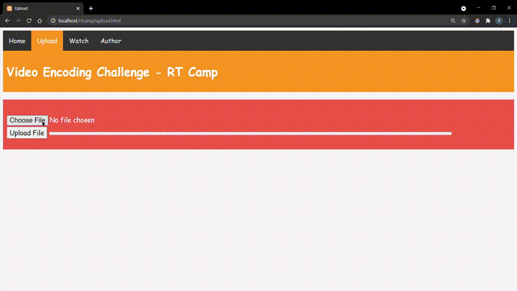
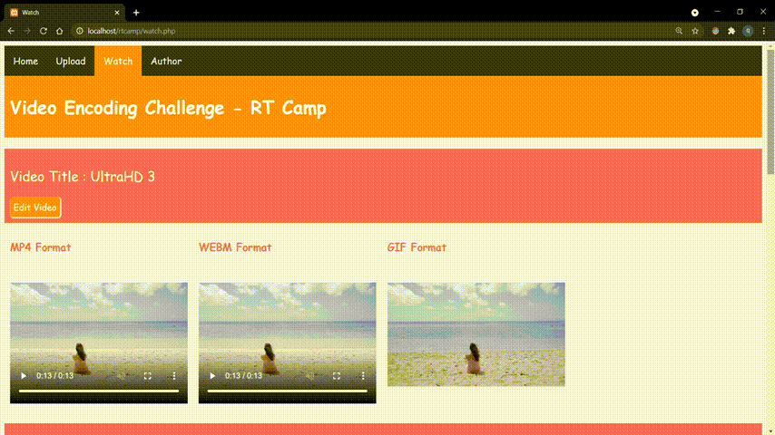
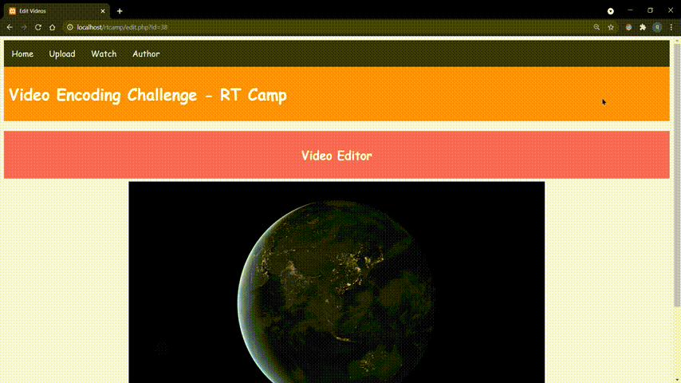

# Video Encoding Challenge - RT Camp

A web application for uploading , watching and editing the videos 🎬

[Live Here](http://ec2-3-108-65-227.ap-south-1.compute.amazonaws.com/) 🌐

⚠️ Please go through the [Note](#note-) Section once before accessing the website.

---

<details open="open">
  <summary>Table of Contents</summary>
  <ol>
    <li><a href="#features">Features</a></li>
    <li><a href="#working-">Working</a></li>
    <li><a href="#note-">Note</a></li>
    <li><a href="#challenges-faced-">Challenge Faced</a></li>
    <li><a href="#built-with">Built With</a></li>
    <li><a href="#requirements-">Requirements</a></li>
    <li><a href="#running-the-project">Running The Project</a></li>
    <li><a href="#future-">Future</a></li>
    <li><a href="#contributing">Contributing</a></li>
    <li><a href="#contact-">Contact</a></li>
    <li><a href="#acknowledgements-">Acknowledgements</a></li>
  </ol>
</details>


## Features

**Upload**: 📂
* A User can upload video in any format.

* Since video uploading takes time the webapp will display  percentage of file uploaded and actual file size uploaded in megaBytes (MB) along with a nice progressbar.



&nbsp;

**Watch**:🎞️

A User can watch the uploaded videos in three formats
  * The original format ***(Not all video formats are supported by browsers)*** ❌
  * webm
  * gif



&nbsp;

**Edit**: ✂️

After uploading the video , a user can also edit it. Following editing functionalities are provided:-
* Text Watermark: A user can add a watermark  to the video.
* Rotate: A user can rotate the video in three ways:
  * 90° ClockWise
  * 90° AntiClockWise
  * 180° 

🛑 <em>Note: Modifications will be done only to the original format of video , due to limited cpu resources.</em>



&nbsp;


## Working 👨‍💻
1. When user uploads the video file , the `file_uploads.php` handler first check for the valid video file extension , if the file is having a valid extension , then the file size is compared against the maximum file size allowed , if the uploaded file size is larger than allowed size than the file is not stored , else the file is stored on the server. 
2. During this process only , a new record is created in the database which stores the name and the Relative file path of the video. 
3. By default a field named `isProcessed` in the database table is also set to `0`. It indicates that the video is just uploaded and it requires further processing.


4. Meanwhile in the background a cron job `post_upload_processing.php` is running which periodically every minute searches for a new video upload <em>(every new video which is just uploaded will have it's `isProcessed` value as `0` </em>). It queries database every minute by using `isProcessed` as its filtering parameter.

5. For each new video upload it will do following :-
    - Generate `Thumbnail`
    - Generate `Gif` 
    - Convert  video to `webm` format
6. And at the end , Relative file paths for `thumbnails` , `gifs` and videos in `webm` format will be saved in the database and the field `isProcessed` will be set to `1`, which will indicate that the video is processed and its `thumbnail` , `gif` and `webm` forms are available for use.


7. When User Requests for edit in the video , the `changes.php` handler updates the video record in database , it changes the `isModified` field from `0` <em>(by default it is 0 which means no modification requested)</em> to `1` <em>(which means there is a modification request for this video).</em>
8. The modified values are also saved to the database , which will later at some point of time will be used by a another cron job `post_edit_request_processing.php` for making actual modifications in the video.


9. As just mentioned , another cron job  named `post_edit_request_processing.php` will be running every minute which will check for video with modification request (i.e `isModified=1`).
10. It will make changes to the video as requested and  will get the required modification values from the database table itself only.
 


## Note 🚫

**TL;DR**

Due to limited processing resources available , Please use small size videos for testing the project.

Recommended Size : Less than `5 MB`

You can download small size sample videos for testing from [here](https://drive.google.com/drive/folders/14pbEnvUNcZYLik7BD7V488vhMO6a1Jw8?usp=sharing).

----

**Server Hardware Limitation** ❗❗

- The webapp is deployed on AWS EC2 instance.
Since I am using AWS Free Tier version  , the configuration of the server is limited to 1 vCPU core only.

- Since every video processing task is highly CPU intensive (<em>unless until you have a dedicated GPU </em>🙂) ,
 the web app takes considerable amount of time for its video processing tasks ***(generation of gifs , thumbnails - conversion  to webm - watermarking text in video - rotate the video)***. Larger the video , more it will consume the resources , longer it will take to process it.

- Moreover these  AWS instance (server) uses burstable CPU model which means instead of having access to full CPU resources all the time, you get access to full CPU resources base on a CPU credit model.When your instance is idling, the instance is building credits up to a cap.
When you use CPU resources, you spend those credits. Once you run out, your CPU usage is capped very low until you build up more credits.  More you can read from [here](https://docs.aws.amazon.com/AWSEC2/latest/UserGuide/burstable-credits-baseline-concepts.html).

- So uploading and editing many videos in a very short span of time could consume all the cpu credits causing the server to become unresponisve for a very long duration of time.

----

## Challenges Faced 🙇
1. First Challenge I encounter was , the request timeout problem which was arising when I was doing processing just after uploading the video only. Similarly I was editing the video just after user submits the edit request . As processing takes time , the server could not give successful response  within a stipulated time and it was often causing request timeout errors . I got to know this problem while I was trying to deploy on heroku where request timeout value is `30 sec` and it is fixed , it can't be changed ❗

     **How I solved**: ✅
    <em>Just when I was going through the heroku docs for changing the request timeout value , from there I came to know the concept of cron jobs which are similar to background processes and they can be configured to run periodically after certain time intervals. So I implemented this technique and created cron jobs which were php scripts only , each for post video uploading task and editing video task.</em>

2. Since I was processing videos in the background , I need to have a queueing system which will ensure that the video which gets uploaded first , or the video which gets request for edit first , will be processed first and also the videos which are supposed to be processed will only get processed , as not all videos require processing all the time . Since no external libraries can be used I have to think of a different approach ❗

    **How I solved:** ✅
    <em>Since I was already using database for storing file paths of video , I tried to implement a queue kind of functionality using database by using some special fields inside the table.
    Following are the fields and their significance :- 
    * `isProcessed` : To check whether video has been processed or not just after the upload. By default it is set to `0` , which means every video requires processing after upload. When the processing is done it is set to `1` indicating that it has done the mandatory after upload processing.
    * `created` : It is timestamp which is used to take decision of which file to be processed first , in case if there are many videos that requires processing.
    * `isModified`: To check whether a video is requested for change. By default it is set to `0` which means no modifications require . When user initiates a request for edit , it's value is set to `1` indicating that there are some modifications to be done in this video .
    * `updated` : Similar to `created` timestamp , it is used to take decision of , in which file modifications to be done first , in case if there are many videos that requires modification.</em>

3. Since there was a video editing functionality present in the webapp , each time when a video was edited , it's file name didn't changed . Since the file name was same , the file paths also remain the same , so google chrome was loading the file from its local cache only thinking that the file is same . So the modified video was not visible until I reopen the webapp in new tab or restart the browser ❗

    **How I solved:** ✅
    <em>While going through various stackoverflow discussions , I find a effective solution that will work irrespective of the browser and their caching methods. The idea was to add a query string with a timestamp value (Here I am using a random number instead of timestamp) to the source of video element , which will tricked the browser thinking that the video source has been changed , so it will load the video from server not from its local cache.</em>

## Built With

* [PHP](https://php.net/)
* [FFmpeg](https://www.ffmpeg.org/)
* [MySQL](https://www.mysql.com/)
* [PHP-FFMpeg](https://github.com/PHP-FFMpeg/PHP-FFMpeg)


## Requirements 📝
  ```sh
PHP 7.2 or higher
FFmpeg 4.4 or higher
Composer 2.0 or higher
MySQL community server
Apache Server
  ```
<details open="open">
<summary><strong>Installing and Configuring Requirements 🔰</strong></summary>

&nbsp;
* For Debian based Linux OS
<br/>(e.g Ubuntu)

  * Installing Apache 
  ```sh
  sudo apt update
  sudo apt install apache2
  sudo ufw allow in "Apache Full" //Adjust the Firewall to Allow incoming HTTP and HTTPS traffic 
  ```
  * Installing MySQL
  ```sh
  sudo apt install mysql-server
  sudo mysql
  mysql> ALTER USER 'root'@'localhost' IDENTIFIED WITH mysql_native_password BY 'password';   //replace with your "password"
  mysql> FLUSH PRIVILEGES;
  mysql> exit
  ```
  * Installing PHP
  ```sh
  sudo apt install php libapache2-mod-php php-mysql
  ```
    * Configuring  Permissions for File Reading/Writing

        * Set RIGHT owner user and owner group for apache root dir: 
            ```sh
            sudo chown -R www-data:www-data /var/www/
            ```
        * Set RIGHT privileges for apache root dir:
            ```sh 
            sudo chmod -R 775 /var/www/
            ```
        * Add apache group to your user:
            ```sh
            sudo usermod -a -G www-data {YOUR_USER_NAME}
            ```
        * Now We have read/write access to files located in apache root dir.And we need to tell apache that new files should be readable/writable to group members .So place umask 002 as last line in below file:
            ```sh
            sudo nano /etc/apache2/envvars
            ```
        * Restart the server 
             ```sh
            sudo apache2ctl restart
            ```
  * Installing FFmpeg

    * Download the latest git build

        ```sh
        wget https://johnvansickle.com/ffmpeg/builds/ffmpeg-git-amd64-static.tar.xz
        ```
    * Unpack the build.

        ```sh
        tar xvf ffmpeg-git-amd64-static.tar.xz
        ```
    * Place all the files in a directory and note down the binary paths of ffmpeg and ffprobe.

        ```sh
        ls ffmpeg-git-20180203-amd64-static
        ffmpeg  ffprobe  GPLv3.txt  manpages  model  qt-faststart  readme.txt
        ```
  * Installing Composer
    
    *   
        ```sh
        sudo apt update
        sudo apt install curl php-cli php-mbstring git unzip
        cd ~
        curl -sS https://getcomposer.org/installer -o composer-setup.php

        ```
    * Next, verify that the installer matches the SHA-384 hash for the latest installer found on the Composer Public Keys / Signatures page. Copy the hash from that page and store it as a shell variable.Now execute the following PHP script to verify that the installation script is safe to run:
        ```sh
        php -r "if (hash_file('SHA384', 'composer-setup.php') === '$HASH') { echo 'Installer verified'; } else { echo 'Installer corrupt'; unlink('composer-setup.php'); } echo PHP_EOL;"

        ```
    * You’ll see the following output.
        ```sh
        Installer verified
        ```
    * use the following command which will download and install Composer as a system-wide command named composer, under /usr/local/bin:
        ```sh
        sudo php composer-setup.php --install-dir=/usr/local/bin --filename=composer
        ```
* For Windows OS

    * Download and Install XAMPP Server from [here](https://www.apachefriends.org/index.html).

    * Download and Install MySQL community Server from [here](https://dev.mysql.com/downloads/mysql/).

    * Download FFmpeg windows build binaries from [here](https://www.gyan.dev/ffmpeg/builds/).

    * Download Composer from [here](https://getcomposer.org/download/).

&nbsp;

####  Database Configuration
&nbsp;
***Edit the config.php file accordingly***
```sh
mysql>create database demo;
mysql>use demo;
mysql>CREATE TABLE videos (
      id int(11) NOT NULL PRIMARY KEY AUTO_INCREMENT,
      name varchar(255) NOT NULL,
      location varchar(255) NOT NULL,
      location_webm varchar(255) ,
      preview varchar(255) ,
      thumbnail varchar(255) ,
      isProcessed tinyint(1) DEFAULT 0, 
      isModified tinyint(1) DEFAULT 0,
      watermark varchar(255) DEFAULT '',
      rotate int(3) DEFAULT 0,
      created timestamp NOT NULL DEFAULT CURRENT_TIMESTAMP,
      updated timestamp DEFAULT CURRENT_TIMESTAMP ON UPDATE CURRENT_TIMESTAMP

      ) ENGINE=InnoDB DEFAULT CHARSET=utf8;
```
</details>


## Running The Project

* For Debian based Linux OS
    <br/>(e.g Ubuntu)
    * Switch to following directory
        ```sh
        cd /var/www/html
        ```

    * Clone the repository
        ```sh
        git clone https://github.com/rtlearn/web-PiyushKhurana.git
        ```
    * Set the path for `ffmpeg` and `ffprobe` binaries in `post_upload_processing.php` and `post_edit_request_processing.php`.
    * Change maximum file size upload limit in `php.ini` to 50MB 
        ```sh
        sudo nano /etc/php/7.2/apache2/php.ini

        //Update these fields and save the file

        post_max_size = 50M
        upload_max_filesize = 50M
        ```
    * Restart Apache Server
        ```sh
        sudo service apache2 restart
        ```
    * Install dependencies using composer
        ```sh
        cd /var/www/html
        composer install
        ```
    * Scheduling Cron jobs for video processing
        ```sh
        sudo crontab -e

        //add below lines
        
        //This will run after every minute

        * * * * * /usr/bin/php /var/www/html/post_upload_processing.php >> /usr/log/upload.log 2>&1
        * * * * * /usr/bin/php /var/www/html/post_edit_request_processing.php >> /usr/log/edit.log 2>&1
        ```

* For Windows OS

    * Open powershell and switch to following directory

        ```sh
        cd C:\xampp\htdocs\
        ```
    * Clone the repository
        ```sh
        git clone https://github.com/rtlearn/web-PiyushKhurana.git
        ```
    * install dependencies using composer
        ```sh
        composer install
        ```
    * Set the path for `ffmpeg` and `ffprobe` binaries in `post_upload_processing.php` and `post_edit_request_processing.php`.
    * Using XAMPP control panel change file upload limit in php.ini file and then restart the  server

    * Scheduling Cron jobs for video processing
        
        * Create a `script.bat` file and put the path to php executable followed by the php script.
        ```sh
        "C:\xampp\php\php.exe" -f "C:\xampp\htdocs\rtcamp\post_upload_processing.php"
        ```
        * Create a `shellscript.vbs` file and put following commands in it along with the path to `script.bat` file. 
        ```sh
        Set WinScriptHost = CreateObject("WScript.Shell")
        WinScriptHost.Run Chr(34) & "C:\script.bat" & Chr(34), 0
        Set WinScriptHost = Nothing
        ```
        
        * Now, we are ready to set the Windows Task Scheduler to run `shellscript.vbs` at the required time interval:

            * open Task Scheduler from windows Start menu.
            * go to Action menu and hit Create Task...
            * in General tab, fill the Name and Description fields as you want.
            * in Triggers tab, hit New button.
            * from Begin the Task dropdown, select On a schedule and choose Daily
            * from Advanced settings section, select Repeat task every : 5 minutes.
            * on Actions tab, from Action dropdown, select Start a program.
            * on the Program\script box, enter path to shellscript.vbs like `C:\shellscript.vbs`.
        * Repeat above steps for `post_edit_request_processing.php`

## Future 🎯

See the [open issues](https://github.com/rtlearn/web-PiyushKhurana/issues) for a list of proposed features (and known issues).


<!-- CONTRIBUTING -->
## Contributing

Contributions are what make the open source community such an amazing place to be learn, inspire, and create. Any contributions you make are **greatly appreciated**.

To contribute to project, follow these steps:

1. Fork this repository.
2. Create a branch: `git checkout -b <your_branch_name>`.
3. Make your changes and commit them: `git commit -m '<commit_message>'`
4. Push to the original branch: `git push origin <your_branch_name>`
5. Create the pull request.

Alternatively see the GitHub documentation on [creating a pull request](https://help.github.com/en/github/collaborating-with-issues-and-pull-requests/creating-a-pull-request).


## Contact 👋

[Piyush Khurana](https://piyushkhurana.github.io/) 😎

If you want to contact me 👀 you can reach me at khuranapiyush27@mail.com.


## Acknowledgements 🙏
* https://www.digitalocean.com/community/tutorials/how-to-install-linux-apache-mysql-php-lamp-stack-ubuntu-18-04
* https://stackoverflow.com/questions/21357421/access-denied-php-move-uploaded-file-ubuntu-lamp-var-www
* https://www.johnvansickle.com/ffmpeg/faq/
* https://www.digitalocean.com/community/tutorials/how-to-install-and-use-composer-on-ubuntu-18-04
* https://stackoverflow.com/questions/24035090/run-cron-job-on-php-script-on-localhost-in-windows
* https://stackoverflow.com/questions/28984106/what-is-cpu-credit-balance-in-ec2


